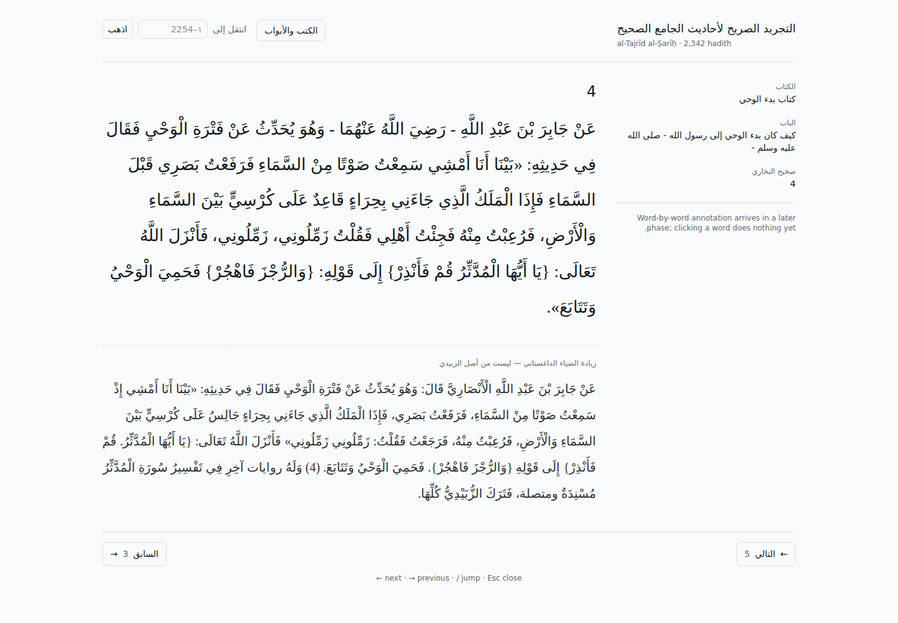
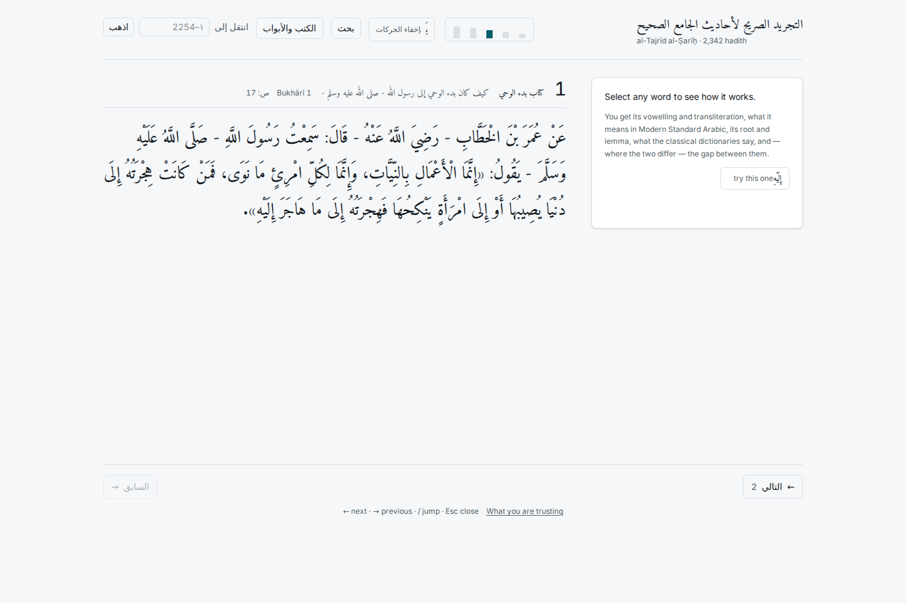

# Phase 5 — shell, routing, navigation

**26/26 browser checks passed.** Driven through headless Chromium against the production build (`web/e2e_phase5.py`); every claim below is an assertion, not an inspection.

| check | result | detail |
|---|---|---|
| / redirects to hadith 1 | PASS | http://127.0.0.1:5173/hadith/1 |
| document is RTL | PASS |  |
| hadith 1 renders text | PASS |  |
| buttons step forward and back | PASS |  |
| ArrowLeft advances, ArrowRight retreats (RTL) | PASS |  |
| '/' focuses the jump field | PASS | jump |
| jump-to reaches the last hadith | PASS |  |
| last hadith renders | PASS |  |
| next is disabled at the end | PASS |  |
| out-of-range number is rejected in place | PASS | النطاق ١ إلى 2254 |
| non-numeric input is rejected | PASS |  |
| book browser opens | PASS |  |
| browser lists every kitab | PASS | 92 |
| browser jumps to the first hadith of a kitab | PASS |  |
| Esc closes the browser | PASS |  |
| deep link restores the record | PASS | showed 1128 |
| deep link restores kitab context | PASS |  |
| back/forward restore both URL and content | PASS |  |
| unknown number shows a 404 state | PASS |  |
| 404 keeps the jump control | PASS |  |
| 404 offers a working way out | PASS |  |
| cumulative layout shift over 12 navigations < 0.02 | PASS | CLS=0.0000 |
| header does not move | PASS | 0.00px |
| Arabic column is on the left of the apparatus | PASS | article x=164, aside x=988 |
| Arabic column is the wider of the two | PASS | article 792px vs aside 288px |
| no horizontal overflow at 380px | PASS | 0px |

## Direction

Arabic runs right to left, so moving forward through the book moves LEFT across
the screen. The next control sits on the left with a left arrow and answers to
`ArrowLeft`; previous sits on the right with a right arrow and answers to
`ArrowRight`. Both are labelled with words as well as arrows, because an arrow
alone is ambiguous to a reader who carries both conventions. The keyboard map in
`useKeyboard.ts` and the visual order in `NavControls.tsx` are the same decision
written twice, and each file says so.

## Screens

A zawa'id addition, shown beneath the hadith it supplements:

