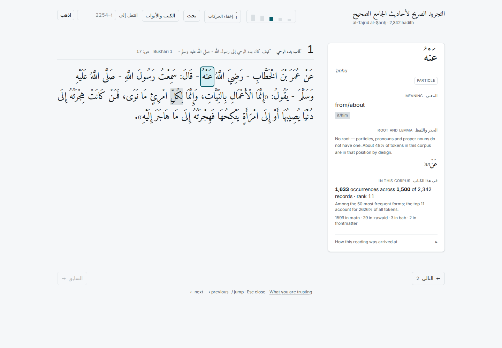

# Phase 6 — the reading pane

**20/20 browser checks passed** (`web/e2e_phase6.py`).

| check | result | detail |
|---|---|---|
| every clickable token is its own element | PASS | 39 spans vs 39 clickable tokens |
| unbound tokens are not focusable | PASS |  |
| same line breaking at sm (20px) | PASS | 3 lines vs 3 |
| line ink extents match within 1px at sm (20px) | PASS | worst deviation 0px across 3 lines; bitmap differs on 0.00% of pixels |
| same line breaking at md (30px) | PASS | 4 lines vs 4 |
| line ink extents match within 1px at md (30px) | PASS | worst deviation 0px across 4 lines; bitmap differs on 1.10% of pixels |
| same line breaking at lg (40px) | PASS | 5 lines vs 5 |
| line ink extents match within 1px at lg (40px) | PASS | worst deviation 0px across 5 lines; bitmap differs on 0.00% of pixels |
| click selects a word | PASS | w=0 |
| selection is visible | PASS |  |
| keyboard traversal reaches every clickable word | PASS | 39/39 |
| traversal never lands on an unbound token | PASS | 0 unbound in this record |
| word arrows do not change the hadith | PASS | http://127.0.0.1:5173/hadith/1?w=38 |
| Escape hands the arrows back to hadith navigation | PASS | http://127.0.0.1:5173/hadith/2 |
| deep link restores the selection | PASS | restored token 4 |
| selection survives a reload | PASS |  |
| selecting words does not stack history entries | PASS | back from http://127.0.0.1:5173/hadith/2 |
| no layout shift on selection | PASS | CLS=0.00000 |
| neighbouring words do not move | PASS | 0.00px |
| confidence is carried into the DOM | PASS | low=0, medium=1 in hadith 7 |

## On measuring shaping

The gate asks for a comparison against the same text as a single unsegmented
block. A raw bitmap diff turned out to be the wrong instrument: each inline box
rounds its own advance width, so a line built from 39 spans can distribute
subpixels differently from the same line as one text node. That lit up 1.10% of
pixels at 30px while nothing about the shaping had changed.

What actually has to hold is that the text breaks into the same lines at the same
places and each line occupies the same ink extent. Measured directly, the worst
deviation is **0px at all three sizes** — identical line counts, identical left
edges, identical widths. The bitmap figure is reported alongside as information
rather than as the criterion.

## Direction, at word scale

Same rule as the hadith controls: the next word is to the LEFT, so ArrowLeft
advances and ArrowRight goes back. The pane is a single tab stop with a roving
tabindex — giving every word its own stop would put 1,635 of them between the
reader and the footer on the longest hadith. Escape releases the pane and hands
the arrows back to hadith navigation.

