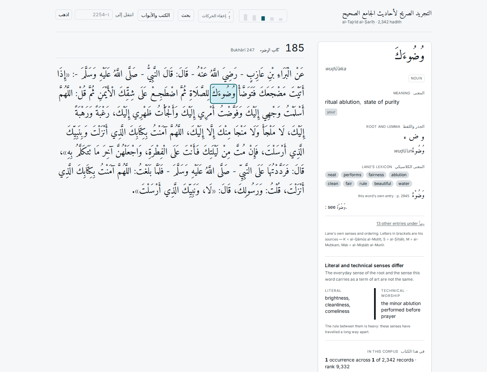

# Phase 7 — the word panel

**164/164 assertions passed** across 38 words (`web/e2e_phase7.py`), sampled to span every `divergence` value, root present and absent, a proper noun, a hapax, a curated technical term, a low-confidence binding, an analyser disagreement and an unbound token.

| assertion | passed |
|---|---|
| Lane sample is labelled as one definition of many | 1/1 |
| a Lane sample appeared in the walkthrough | 1/1 |
| absent root is explained, not left blank | 1/1 |
| analyser disagreement warns that the root may be wrong | 1/1 |
| curated shows both literal and technical | 1/1 |
| empty state invites action | 1/1 |
| empty state suggests a word | 1/1 |
| empty-state suggestion selects a word | 1/1 |
| every divergence value was exercised | 1/1 |
| no console or page errors during the walkthrough | 1/1 |
| no lonely label | 38/38 |
| no raw Buckwalter | 38/38 |
| no untreated nulls | 38/38 |
| not_applicable shows no divergence section | 1/1 |
| panel is not empty | 38/38 |
| provenance is collapsed by default | 1/1 |

## The gloss parser

`gloss_msa` ships as a Buckwalter string — `the + prayer;salat + [fem.sg.]`. The spec
forbids dumping it raw, so it is parsed at BUILD time, once, and validated against all
21,028 glosses: 0 failures, 0 empty sense lists, 0 markup leaks. The raw string never
reaches the client at all, which is a stronger guarantee than remembering not to render it.

Finding the stem is the only hard part and it is not positional. In
`the + prayer;salat + [fem.sg.]` the stem is slot 1; in `and + I + leave;quit` it is
slot 2, because `I` is the imperfect subject prefix. The parser identifies the stem by
elimination against a closed clitic set built from what actually occupies the proclitic
slot in the data.

## Keyword clusters needed cleaning

`classical_keywords` is the field the workbook's README calls trustworthy, but the
extraction carries Lane's editorial vocabulary with it. Measured across 1,829 roots:
`tropical` appears in 51% of entries, `became` in 35%, `assumed` in 29% — these are
usage markers, not senses. `voce` is Latin and `iaar` is OCR debris.

A frequency cutoff would be the wrong tool: `camel` is in 15.5% of entries and `water`
in 12.9%, and both are real — Arabic lexicography is full of camels. So the filter is by
KIND (Lane apparatus plus English function words) and frequency is used only to ORDER
what survives, so each cluster leads with what characterises that root.

Before: `prayer, divinely, appointed, prophet, place, tail, have, blessing, expl, camel, prayed, particularly, next, bone`  
After: `divinely, prayed, prophet, blessing, appointed, tail, prayer, bone, camel, place`

