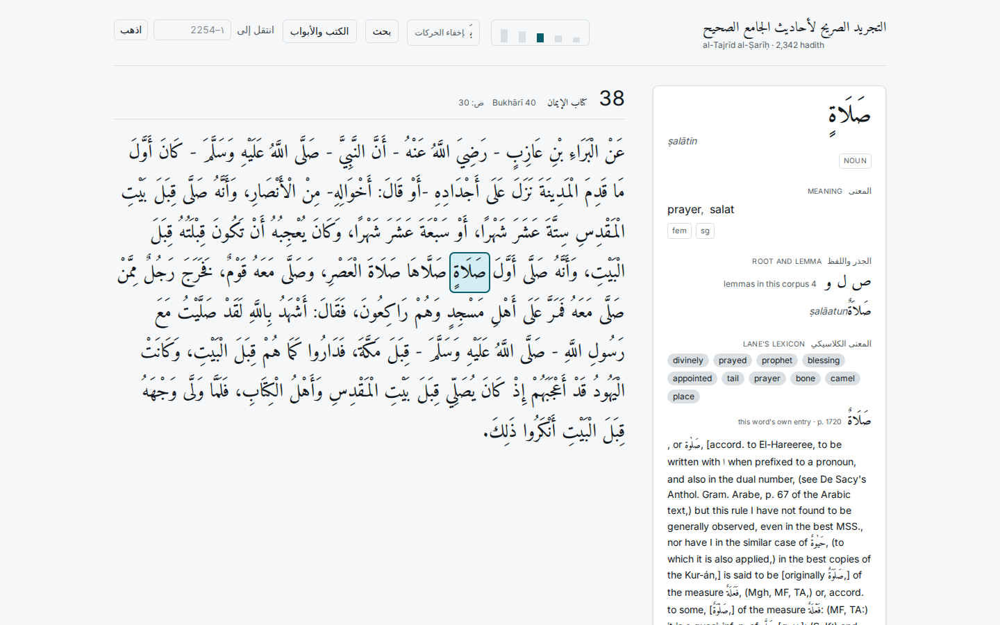
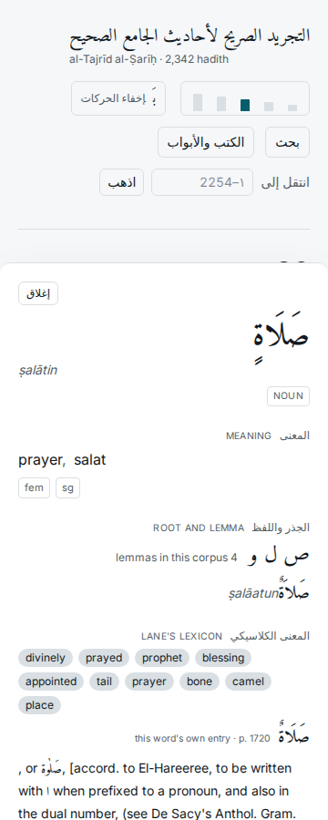

# Phase 8 — controls, design, polish

**Lighthouse accessibility: 100** (0 failing audits; gate is ≥95).  
**31/31 browser checks passed** (`web/e2e_phase8.py`).  
Phases 5, 6 and 7 re-run green after the redesign: 26/26, 20/20, 164/164.

| check | result | detail |
|---|---|---|
| contrast light: active size tick (non-text) | PASS | 7.02:1 (needs 3.0, 99px) |
| contrast light: Arabic word on paper | PASS | 16.5:1 (needs 3.0, 28px) |
| contrast light: Arabic word, SELECTED | PASS | 14.57:1 (needs 3.0, 28px) |
| contrast light: Arabic word, HOVERED | PASS | 13.27:1 (needs 3.0, 28px) |
| contrast light: panel body text | PASS | 17.71:1 (needs 3.0, 36px) |
| contrast light: header subtitle (muted) | PASS | 6.06:1 (needs 4.5, 12px) |
| contrast light: keyboard hint (muted, small) | PASS | 6.06:1 (needs 4.5, 12px) |
| hover state resolves a colour (light) | PASS | {'bg': 'oklab(0.899997 -0.00424767 -0.00676316 / 0.992963)', 'fg': 'lab(8.35375 -1.69004 -4.72319)'} |
| contrast dark: active size tick (non-text) | PASS | 10.86:1 (needs 3.0, 99px) |
| contrast dark: Arabic word on paper | PASS | 15.02:1 (needs 3.0, 28px) |
| contrast dark: Arabic word, SELECTED | PASS | 9.81:1 (needs 3.0, 28px) |
| contrast dark: Arabic word, HOVERED | PASS | 9.43:1 (needs 3.0, 28px) |
| contrast dark: panel body text | PASS | 13.58:1 (needs 3.0, 36px) |
| contrast dark: header subtitle (muted) | PASS | 7.98:1 (needs 4.5, 12px) |
| contrast dark: keyboard hint (muted, small) | PASS | 7.98:1 (needs 4.5, 12px) |
| hover state resolves a colour (dark) | PASS | {'bg': 'oklab(0.349998 -0.0060029 -0.0103838 / 0.992933)', 'fg': 'lab(91.8927 -1.3099 -2.6396)'} |
| reduced motion kills all transitions | PASS | [] |
| size control is reachable by Tab | PASS |  |
| size control works from the keyboard | PASS | 28px -> 20px |
| size step is recorded on the document | PASS |  |
| size choice persists across a reload | PASS | step 1 |
| harakat toggle removes the vowel marks | PASS | 'عن' |
| harakat toggle restores them | PASS | 'عَنْ' |
| word selectable by keyboard | PASS | http://127.0.0.1:5173/hadith/1?w=4 |
| Escape clears the selection | PASS | http://127.0.0.1:5173/hadith/1 |
| no horizontal overflow at 360px | PASS | 0px |
| panel is a bottom sheet at 360px | PASS | bottom at 900 of 900 |
| no horizontal overflow at 768px | PASS | 0px |
| panel is a bottom sheet at 768px | PASS | bottom at 900 of 900 |
| no horizontal overflow at 1440px | PASS | 0px |
| panel is a right column at 1440px | PASS | article 736px, aside 336px |

## Direction

**A reading instrument, not a manuscript.** What is distinctive about this product is
not that the text is old — it is that it tells you how it knows. Every word carries a
provenance and the panel says plainly when a vowel was witnessed and when it was
guessed. So the surface is a precisely-set critical edition: cool paper, archival ink,
generous air around the Arabic, a dense but calm apparatus beside it.

Measured from the rendered screenshots, the page is `#f5f7f9` — cool, with a blue bias.
Explicitly not the cream-and-terracotta pastiche the brief and the design skill both
warn against; there is no clay accent anywhere. Colour does two jobs only: teal for
selection and focus, plum for the places where the data may be wrong.

## Typography, chosen on measurement

**Amiri** for the Arabic, a Bulaq-revival naskh. Under a full harakat load it needs
**1.90× its font size** in vertical ink, against Scheherazade New at 1.80× and Noto
Naskh at 1.40×. That is the most demanding of the three and it is why it was chosen:
this product exists to teach vocalisation, so the marks are the content and they need
room.

It is also why **the leading falls as the size rises** — 2.25 at step 1 down to 1.92 at
step 5. The mark stack takes a fixed proportion of the em, so at 20px a line has about
2px of clearance and at 40px about 7px. A constant line-height looks fine in a specimen
and crowds the harakat at the smallest step.

**Inter** for the apparatus, and that choice was forced rather than free. Transliteration
needs ʿ (U+02BF) and ʾ (U+02BE). Of five sans faces checked against the full set:
IBM Plex Sans lacks twelve of fifteen, Archivo lacks six, Public Sans lacks both hamza
marks, Fira Sans lacks ʾ. Only Inter and Source Serif 4 are complete, and a serif would
compete with the naskh.

## The signature

The literal/technical divergence is set as **facing columns divided by a gutter rule**,
the way a critical edition sets variant readings against each other — because that is
what it is. The rule's weight carries `overlap_score`: a hairline means the senses
nearly coincide, a heavy rule means they have pulled apart. The brief forbids printing
the bare number, and rightly — `0.14` tells a student nothing, but a thick rule between
two columns tells them the gap is wide.

No colour, no icon, no tinted box. This is the one place the design raises its voice and
it does it with type and rule alone. The earlier amber-tinted version was the accessory
removed before leaving the house.

